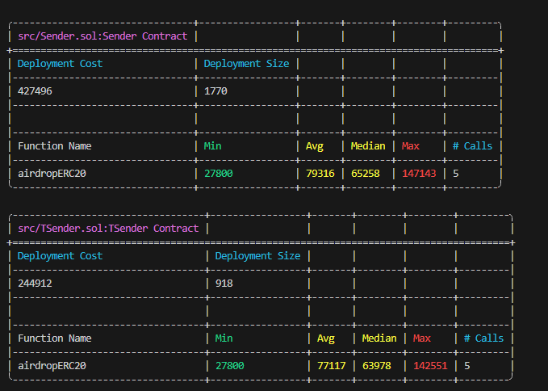

# ERC20 Airdrop Sender

## Overview

This project provides a set of Solidity smart contracts for efficiently airdropping ERC20 tokens to multiple recipients. It includes two primary contracts: `Sender`, a straightforward implementation, and `TSender`, a highly gas-optimized version using inline assembly.

The contracts are designed to be simple, secure, and efficient, making them ideal for token distribution events, community rewards, and other bulk-sending scenarios.

## Features

- **Bulk ERC20 Distribution:** Airdrop tokens to a large number of addresses in a single transaction.
- **Gas Efficiency:** Includes a gas-optimized `TSender` contract that significantly reduces transaction costs by using inline assembly.
- **Safety Checks:**
    - Validates that the number of recipients matches the number of amounts.
    - Prevents sending tokens to the zero address.
    - Ensures the sum of individual amounts equals the total amount transferred to the contract.
    - Reverts on token transfer failures.
- **Testing:** Comprehensive test suite using Foundry to ensure contract correctness and for gas comparison.
- **Deployment Scripts:** Includes a basic Foundry script for easy deployment.

## Smart Contracts

### `src/Sender.sol`

This is the standard implementation of the airdrop contract. It works in two main steps:
1.  It receives the total amount of tokens from the caller via `transferFrom`. The caller must have pre-approved the `Sender` contract to spend the tokens.
2.  It iterates through the lists of recipients and amounts, transferring the specified amount to each recipient using the standard `transfer` function.

This version is written in high-level Solidity, making it easy to read and understand.

### `src/TSender.sol`

`TSender` is a gas-optimized version of `Sender`. It performs the same airdrop functionality but leverages inline assembly (`assembly {}`) and low-level calls to minimize gas consumption. This approach is inspired by the popular [GasliteDrop](https://github.com/PopPunkLLC/GasliteDrop) contracts and is ideal for airdrops to a very large number of recipients where transaction costs are a primary concern.

### Gas Comparison

The project is set up to compare the gas usage of `Sender` and `TSender`. The test files `test/Sender.t.sol` and `test/TSender.t.sol` contain identical test logic for their respective contracts. By running the gas reporter, you can see a detailed breakdown of the gas costs for each function and observe the efficiency gains of the `TSender` contract.

### Gas Report Example



## Real-World Use Case

Imagine a new DeFi protocol that wants to reward its early users. They have a list of 1,000 user addresses and want to send 100 of their new governance tokens to each.

Instead of sending 1,000 separate transactions (which would be extremely expensive and time-consuming), they can use the `TSender` contract. They would:
1.  Call the `approve` function on their token contract, approving the deployed `TSender` contract to spend `100,000` tokens (`1,000 users * 100 tokens`).
2.  Call the `airdropERC20` function on the `TSender` contract, providing the token address, the array of 1,000 recipient addresses, the corresponding array of amounts (100 tokens for each), and the total amount of `100,000` tokens.

The entire airdrop is completed in a single, gas-efficient transaction, saving the project a significant amount in network fees.

## Getting Started

### Prerequisites

- [Foundry](https://getfoundry.sh/)

### Installation

1.  Clone the repository:
    ```shell
    git clone https://github.com/your-username/airdrop-sender.git
    cd airdrop-sender
    ```

2.  Install dependencies:
    ```shell
    forge install
    ```

### Build

Compile the smart contracts:
```shell
forge build
```

### Testing

Run the test suite:
```shell
forge test
```

To see the gas report and compare the `Sender` and `TSender` contracts, run:
```shell
forge test --gas-report
```

### Deployment

The `script/Sender.s.sol` and `script/TSender.s.sol` files contains a basic deployment script for the contract. You can deploy it to a network like this:

```shell
forge script script/Sender.s.sol:DeployScript --rpc-url $YOUR_RPC_URL --private-key $YOUR_PRIVATE_KEY --broadcast
forge script script/TSender.s.sol:DeployScript --rpc-url $YOUR_RPC_URL --private-key $YOUR_PRIVATE_KEY --broadcast
```

Remember to replace `$YOUR_RPC_URL` and `$YOUR_PRIVATE_KEY` with your actual data. To deploy the `TSender` contract, you would create a similar script for it.